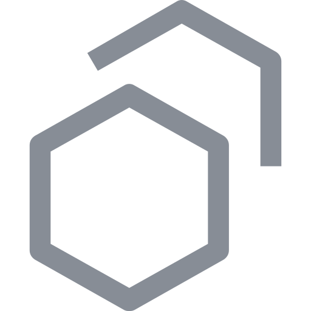

# Polyxd

[](https://www.npmjs.com/package/@polyxd/react) [](https://www.npmjs.com/package/@polyxd/web) [](https://www.npmjs.com/package/@polyxd/spec) [](https://www.npmjs.com/package/@polyxd/verifier) [](https://www.npmjs.com/package/polyxd) [](https://www.npmjs.com/org/polyxd) [](LICENSE)

**An open spec, renderer and verifier for interfaces generated on demand** — rendered natively in your design system, operable by people and agents alike, and checked before anyone sees them.

A request comes in. Something — a model, a backend, a rules engine, a person — writes a **UI document**: a small JSON file of semantic components ("a choice", "a confirmation", "a table") bound to data your app provides. A renderer turns it into your design system's components. A verifier checks it for accessibility, safety and whether an agent can operate it. Then it's used, and thrown away.

```
request ──► generator (any model or program that emits spec-valid JSON)
                      │  UI document: meaning only — no pixels, colours or fonts
                      ▼
              renderer (@polyxd/react, themed by a design-system pack)
                      │
                      ▼
              verifier → score, findings, agent task results
```

**Site and docs:** [polyxd.com](https://polyxd.com) · **Live gallery:** [polyxd.com/gallery](https://polyxd.com/gallery/)

## Packages on npm

All 37 packages are on npm under the [`@polyxd` organisation](https://www.npmjs.com/org/polyxd): the twelve below, the `polyxd` CLI among them, then [thirteen design-system packs](#the-design-systems) and [twelve templates](#the-templates).

| Package | What it is | Version |
|---|---|---|
| [`@polyxd/spec`](https://www.npmjs.com/package/@polyxd/spec) | The spec: components, patterns, the action registry and the JSON Schema | [](https://www.npmjs.com/package/@polyxd/spec) |
| [`@polyxd/react`](https://www.npmjs.com/package/@polyxd/react) | The React renderer | [](https://www.npmjs.com/package/@polyxd/react) |
| [`@polyxd/web`](https://www.npmjs.com/package/@polyxd/web) | The Web Components renderer (Vue and Svelte adapters in its README) | [](https://www.npmjs.com/package/@polyxd/web) |
| [`@polyxd/core`](https://www.npmjs.com/package/@polyxd/core) | What both renderers share | [](https://www.npmjs.com/package/@polyxd/core) |
| [`@polyxd/verifier`](https://www.npmjs.com/package/@polyxd/verifier) | The verifier: schema, patterns, accessibility, contrast and agent tasks | [](https://www.npmjs.com/package/@polyxd/verifier) |
| [`polyxd`](https://www.npmjs.com/package/polyxd) | The CLI: `pack`, `check`, `dev`, `studio push` | [](https://www.npmjs.com/package/polyxd) |
| [`@polyxd/runtime`](https://www.npmjs.com/package/@polyxd/runtime) | Generates a document with the model you choose | [](https://www.npmjs.com/package/@polyxd/runtime) |
| [`@polyxd/server`](https://www.npmjs.com/package/@polyxd/server) | A generation server around the runtime (also `ghcr.io/visualfart/polyxd-server`) | [](https://www.npmjs.com/package/@polyxd/server) |
| [`@polyxd/mcp`](https://www.npmjs.com/package/@polyxd/mcp) | An MCP server: the spec, checks and live screens for a host's model | [](https://www.npmjs.com/package/@polyxd/mcp) |
| [`@polyxd/a2ui`](https://www.npmjs.com/package/@polyxd/a2ui) | Export to A2UI | [](https://www.npmjs.com/package/@polyxd/a2ui) |
| [`@polyxd/analytics`](https://www.npmjs.com/package/@polyxd/analytics) | Adapters for the renderers' semantic events | [](https://www.npmjs.com/package/@polyxd/analytics) |
| [`@polyxd/ds-kit`](https://www.npmjs.com/package/@polyxd/ds-kit) | Builds design-system packs, including yours with `polyxd pack` | [](https://www.npmjs.com/package/@polyxd/ds-kit) |

## What works today

| | |
|---|---|
| **Spec** | 44 semantic components (five of them the product's shell, authored only), 6 patterns with self-checking rules, capability registry with risk levels, Design Direction for a designer's taste, JSON Schema, A2UI export |
| **Renderers** | `@polyxd/react` on Radix primitives and `@polyxd/web` as Web Components, both on `@polyxd/core`: token-only CSS, container queries, dense B2B tables and navigation, density scale with a touch floor. A conformance suite holds the two to the same DOM, ARIA, text and findings across every document and pack; any renderer can be held to it ([Renderers](https://polyxd.com/docs/renderers/)) |
| **Events** | Both renderers emit semantic analytics events when you pass `onEvent`: shown, actions, checkpoints, completion, abandonment, input errors, statuses, undo. Keys and codes only, never what anyone typed. They go to your analytics (`@polyxd/analytics` has PostHog, Segment, GA4 and fetch adapters); Polyxd receives none of them unless you send them to Studio Insights ([Events](https://polyxd.com/docs/product/#semantic-analytics-events)) |
| **Design systems** | 13 packs on one token contract: Material 3, Carbon, Ant Design, Fluent 2, shadcn/ui, Bootstrap 5, Mantine, Radix Themes, Shopify Polaris, GitHub Primer, Adobe Spectrum 2, GOV.UK Frontend, Chakra UI. Bring your own tokens with `npx polyxd pack` and it builds a pack from them |
| **Verifier** | Schema, structure, pattern, capability and copy checks; axe-core, contrast and target-size audits in every pack, mode and width; scripted agents completing tasks through the accessibility tree alone |

All 24 examples score 100 across **1,248 renders** (13 packs × 2 widths × light and dark), **936 of 936** agent tasks complete by name alone, and the verifier catches **20 of 20** deliberately injected defects.

**There is no bundled model.** Any generator that emits spec-valid JSON drives Polyxd. See [Bring your generator](#bring-your-generator).

### The design systems

| | Design system | Pack | Version |
|---|---|---|---|
|  | Material 3 | [`@polyxd/ds-material3`](packages/ds-material3/) | [](https://www.npmjs.com/package/@polyxd/ds-material3) |
|  | IBM Carbon | [`@polyxd/ds-carbon`](packages/ds-carbon/) | [](https://www.npmjs.com/package/@polyxd/ds-carbon) |
|  | Ant Design | [`@polyxd/ds-antd`](packages/ds-antd/) | [](https://www.npmjs.com/package/@polyxd/ds-antd) |
|  | Microsoft Fluent 2 | [`@polyxd/ds-fluent`](packages/ds-fluent/) | [](https://www.npmjs.com/package/@polyxd/ds-fluent) |
|  | shadcn/ui | [`@polyxd/ds-shadcn`](packages/ds-shadcn/) | [](https://www.npmjs.com/package/@polyxd/ds-shadcn) |
| <picture><source media="(prefers-color-scheme: dark)" srcset="packages/ds-bootstrap/logo-white.svg"></picture> | Bootstrap 5 | [`@polyxd/ds-bootstrap`](packages/ds-bootstrap/) | [](https://www.npmjs.com/package/@polyxd/ds-bootstrap) |
|  | Mantine 8 | [`@polyxd/ds-mantine`](packages/ds-mantine/) | [](https://www.npmjs.com/package/@polyxd/ds-mantine) |
| <picture><source media="(prefers-color-scheme: dark)" srcset="packages/ds-radix/logo-white.svg"></picture> | Radix Themes 3 | [`@polyxd/ds-radix`](packages/ds-radix/) | [](https://www.npmjs.com/package/@polyxd/ds-radix) |
|  | Shopify Polaris | [`@polyxd/ds-polaris`](packages/ds-polaris/) | [](https://www.npmjs.com/package/@polyxd/ds-polaris) |
|  | GitHub Primer | [`@polyxd/ds-primer`](packages/ds-primer/) | [](https://www.npmjs.com/package/@polyxd/ds-primer) |
|  | Adobe Spectrum 2 | [`@polyxd/ds-spectrum`](packages/ds-spectrum/) | [](https://www.npmjs.com/package/@polyxd/ds-spectrum) |
|  | GOV.UK Design System | [`@polyxd/ds-govuk`](packages/ds-govuk/) | [](https://www.npmjs.com/package/@polyxd/ds-govuk) |
|  | Chakra UI 3 | [`@polyxd/ds-chakra`](packages/ds-chakra/) | [](https://www.npmjs.com/package/@polyxd/ds-chakra) |

Each logo is its owner's own file, unaltered, used to identify the design system a pack is modelled on (where a system has no mark of its own, its company's logo). Several owners' guidelines restrict logo use without permission; each pack's README records the source and the guidelines. GOV.UK's crown and logotype are protected, so it is named in words alone. Twelve original templates (`sketch`, `wireframe`, `editorial`, `brutalist`, `glass`, `terminal`, `pastel`, `civic`, `finance`, `health`, `neon`, `mono`) sit beside them, each with a mark drawn from its own tokens.

### The templates

Twelve original packs, made to be copied and changed.

| Template | Pack | Version |
|---|---|---|
| Brutalist | [`@polyxd/ds-brutalist`](packages/ds-brutalist/) | [](https://www.npmjs.com/package/@polyxd/ds-brutalist) |
| Civic | [`@polyxd/ds-civic`](packages/ds-civic/) | [](https://www.npmjs.com/package/@polyxd/ds-civic) |
| Editorial | [`@polyxd/ds-editorial`](packages/ds-editorial/) | [](https://www.npmjs.com/package/@polyxd/ds-editorial) |
| Finance | [`@polyxd/ds-finance`](packages/ds-finance/) | [](https://www.npmjs.com/package/@polyxd/ds-finance) |
| Glass | [`@polyxd/ds-glass`](packages/ds-glass/) | [](https://www.npmjs.com/package/@polyxd/ds-glass) |
| Health | [`@polyxd/ds-health`](packages/ds-health/) | [](https://www.npmjs.com/package/@polyxd/ds-health) |
| Mono | [`@polyxd/ds-mono`](packages/ds-mono/) | [](https://www.npmjs.com/package/@polyxd/ds-mono) |
| Neon | [`@polyxd/ds-neon`](packages/ds-neon/) | [](https://www.npmjs.com/package/@polyxd/ds-neon) |
| Pastel | [`@polyxd/ds-pastel`](packages/ds-pastel/) | [](https://www.npmjs.com/package/@polyxd/ds-pastel) |
| Sketch | [`@polyxd/ds-sketch`](packages/ds-sketch/) | [](https://www.npmjs.com/package/@polyxd/ds-sketch) |
| Terminal | [`@polyxd/ds-terminal`](packages/ds-terminal/) | [](https://www.npmjs.com/package/@polyxd/ds-terminal) |
| Wireframe | [`@polyxd/ds-wireframe`](packages/ds-wireframe/) | [](https://www.npmjs.com/package/@polyxd/ds-wireframe) |

## Try it

```sh
npm install @polyxd/react @polyxd/spec
```

Render a document:

```tsx
import { PolyxdSurface } from "@polyxd/react";
import "@polyxd/react/styles.css";
import "@polyxd/react/themes/carbon.css";

<PolyxdSurface
  document={doc}                     // a UI document
  data={{ quote }}                   // your data; the document binds to it
  theme="carbon"
  mode="light"
  onAction={({ name, context }) => {  // capabilities the document may trigger
    if (name === "transfer.confirm") sendMoney(context.quoteId);
  }}
/>
```

Validate and verify it:

```sh
npx polyxd-validate my-ui.json                 # schema and structural rules, from @polyxd/spec
npm install -D @polyxd/verifier playwright && npx playwright install chromium
npx polyxd-verify my-ui.json --themes carbon   # rendered light and dark, phone and desktop; axe, contrast, layout
```

Point it at **your** design system:

```sh
npx polyxd pack ./src/tokens.css
```

It reads your CSS custom properties, maps what it can onto the contract, writes a pack plus a mapping file of every guess it made, and reports what's still missing — including any of your own colour pairs that fail contrast. [How it guesses](https://polyxd.com/docs/your-design-system/).

| Package | |
|---|---|
| [`@polyxd/core`](https://www.npmjs.com/package/@polyxd/core) | The framework-free core every renderer shares: types, bindings, formatting, the renderer's decisions, a headless surface |
| [`@polyxd/react`](https://www.npmjs.com/package/@polyxd/react) | The React renderer, with compiled theme CSS for every pack |
| [`@polyxd/web`](https://www.npmjs.com/package/@polyxd/web) | The Web Components renderer: `<polyxd-surface>`, `<polyxd-frame>`, no framework; Vue and Svelte adapters to copy |
| `@polyxd/analytics` | Sends the renderers' semantic events (what people do on a screen, never what they type) to your own PostHog, Segment, Google Analytics 4 or endpoint, through an allow-list guard. Polyxd receives none of them, unless you send them to Studio Insights. On npm. The renderers emit the events from 0.4.1 on |
| [`@polyxd/spec`](https://www.npmjs.com/package/@polyxd/spec) | Types, JSON Schema, validator, patterns, token contract; `polyxd-validate` |
| [`@polyxd/verifier`](https://www.npmjs.com/package/@polyxd/verifier) | `polyxd-verify`: static, rendered and agent checks |
| `polyxd-spec` (Python) | The schemas, component catalogue and validator for Python, with the same results as `@polyxd/spec`; `polyxd-spec validate`. In [`packages/python-spec`](packages/python-spec), not yet on PyPI |
| [`@polyxd/a2ui`](https://www.npmjs.com/package/@polyxd/a2ui) | Export to A2UI v1.0 |
| [`@polyxd/runtime`](https://www.npmjs.com/package/@polyxd/runtime) | Generates a document for an ask with the model you choose, with your Design Direction applied: validation and repair, streaming, and interface memory on the client |
| [`@polyxd/mcp`](https://www.npmjs.com/package/@polyxd/mcp) | MCP server (`npx -y @polyxd/mcp`): the spec for the host's model, validation and verification, and an MCP App that shows the screen in any pack. Also hosted at `https://mcp.polyxd.com/mcp` |
| [`@polyxd/server`](https://www.npmjs.com/package/@polyxd/server) | Generation server: the runtime behind an HTTP API (`POST /v1/generate`, JSON or server-sent events), pointed at the model you choose; a Docker image or `npx @polyxd/server` |
| [`polyxd`](https://www.npmjs.com/package/polyxd) | The `polyxd` command: `pack` and `check` |
| [`@polyxd/ds-kit`](https://www.npmjs.com/package/@polyxd/ds-kit) | The library behind `polyxd pack` |
| `@polyxd/ds-*` | The thirteen packs as DTCG tokens, for building your own themes, plus twelve original templates to start from (`sketch`, `wireframe`, `editorial`, `brutalist`, `glass`, `terminal`, `pastel`, `civic`, `finance`, `health`, `neon`, `mono`). The renderer already includes their CSS |

### From source

Tested on Node 26; the repository's scripts run TypeScript directly, so you need a Node that strips types without a flag.

```sh
git clone https://github.com/visualfart/polyxd.git && cd polyxd
npm install
npm run dev -w @polyxd/gallery          # every example, in every pack, at phone, tablet and desktop
npm run test:all                        # every workspace's tests, with one total
npm run verify:packs -w @polyxd/verifier   # the 1,248 renders
npm run conformance -w @polyxd/verifier    # both renderers, every document, 13 packs: same DOM, ARIA, text and findings
```

Polyxd is for **surfaces**, generated or authored. A designer can write the same document on purpose, as a screen of the product; it renders in the same design system and is verified by the same rules. Since spec 0.3 the product's shell (the frame, app bar, navigation and footer around every screen) can be a document too: authored once per product, never generated, with the validator refusing shell components anywhere else. See the [demos](https://polyxd.com/demos/): three products in three design systems, with generated and authored screens side by side.

## Who it's for

- **Products with an assistant** that can answer in text but can't show the confirmation dialog, because building a screen per intent is unbounded work. Especially where generated UI has to be safe and accessible, not just plausible.
- **Server-driven UI, with no AI at all.** The document format is the product; anything that emits JSON can drive it.
- **Internal tools** — the long tail of admin screens nobody will fund as code.
- **Design teams** who want to author screens once, in meaning, and have them render in every design system they ship and be checked before release. [Studio](https://studio.polyxd.com) has a Screens editor for exactly that.
- **Anyone whose product someone else's agent will operate.** Every surface is operable through its accessibility tree by construction.

Not for: a handful of intents in one design system (hand-build them), or the flagship flow that *is* your product.

## Bring your generator

Polyxd ships no model. Any model or program that emits spec-valid JSON drives it: Claude, GPT, Gemini, a model you run yourself, a template, or plain code. Give the generator the spec and the data, take the UI document it writes, and pass it to the renderer. The verifier checks what it wrote, in every pack, mode and width, before anyone sees it. Taste comes from [Design Direction](https://polyxd.com/docs/design-direction/), which a designer sets once and the verifier holds every surface to.

[`@polyxd/runtime`](packages/runtime/) does the generating part for you: it builds the prompt from the spec and your Direction, calls Claude, GPT, Gemini or a local model behind an OpenAI-compatible endpoint, checks the answer and sends problems back for repair, streams, and remembers the screen shown for each intent. See [Runtime](https://polyxd.com/docs/runtime/).

[`@polyxd/server`](packages/server/) puts the runtime behind an HTTP API with streaming, for when the model key has to stay on a server or the code that wants a screen isn't JavaScript. Run it with `npx @polyxd/server` or the Docker image `ghcr.io/visualfart/polyxd-server`. See [Generation server](https://polyxd.com/docs/server/).

## Repository

| | |
|---|---|
| `packages/spec` | The spec: components, patterns, token contract, validator, JSON Schema |
| `packages/python-spec` | The spec for Python: copies of the schemas and components, and a port of the validator checked against the TypeScript one (`npm run test:python`, needs [uv](https://docs.astral.sh/uv/)) |
| `packages/core` | The framework-free core: document types, bindings, formatting, the renderer's decisions, the headless surface |
| `packages/react` | The React renderer and the compiled theme CSS for every pack |
| `packages/web` | The Web Components renderer, its preview bundle, and the Vue and Svelte adapters |
| `packages/verifier` | Static, rendered and agent checks; the benchmark scorer |
| `packages/runtime` | Generation with the model you choose: the prompt from the spec and a Design Direction, adapters, validation and repair, streaming, interface memory |
| `packages/ds-*` | Thirteen design-system packs, each generated from vendored, version-pinned sources, plus twelve original templates (`"template": true` in the manifest) meant to be copied and changed |
| `packages/ds-kit` | Builds packs — including the `polyxd pack` command for yours |
| `packages/a2ui` | Export to A2UI v1.0 |
| `packages/mcp` | The MCP server and its MCP App |
| `packages/server` | The generation server: the runtime behind an HTTP API with streaming, and its Dockerfile |
| `apps/gallery`, `apps/site` | The gallery and polyxd.com |
| `apps/mcp` | The hosted MCP server at mcp.polyxd.com: `packages/mcp` over Streamable HTTP in a Cloudflare Worker |
| `apps/stats` | An internal scheduled Worker that records adoption (npm, the editor stores, GitHub, the MCP Registry) into PostHog daily |
| `bench/` | Benchmark requests, agent tasks, the gold set and the designer's rankings |
| `model/` | Training and evaluation experiments (paused; see research/report.md) |
| `design/flows` | Source of the approved flow designs the spec and renderer are built against |
| `research/` | The research log |

[PLAN.md](PLAN.md) is the project plan; `docs/decisions/` records why things are the way they are.

## Contributing

Issues and pull requests are welcome. The most useful single contribution is **a pack for a design system that isn't here** — `polyxd pack` does most of the work, and [Design systems](https://polyxd.com/docs/design-systems/) explains the rule every pack follows: where a role fails contrast, move along that system's own ramp, and write down why.

Before a pull request: `npm run test:all` and `npm run check:licences`.

## Licence

Code is [Apache-2.0](LICENSE); the spec and documentation are [CC-BY-4.0](https://creativecommons.org/licenses/by/4.0/). [NOTICE](NOTICE) lists every vendored source and its licence.

The design-system packs are Polyxd's work, reading each system's published tokens. Polyxd is not affiliated with, endorsed by or sponsored by any of those projects or their owners, and each name is the trademark of its owner.
