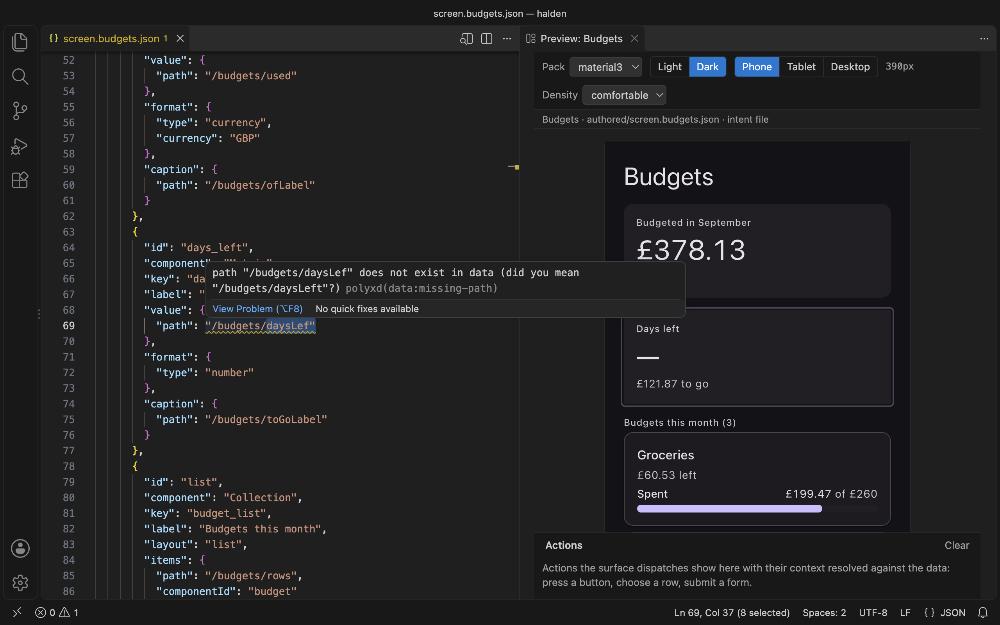
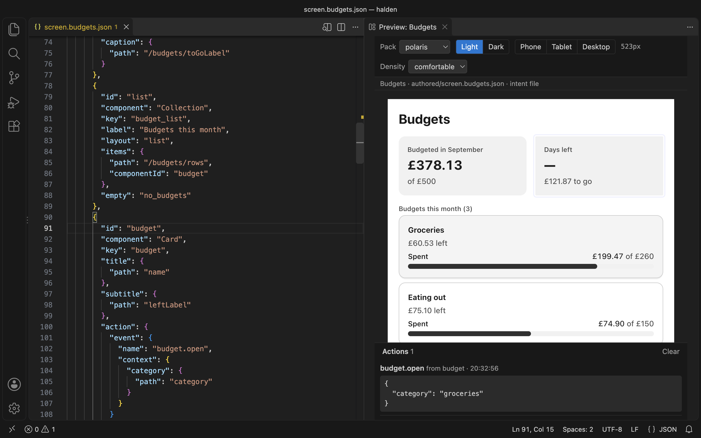
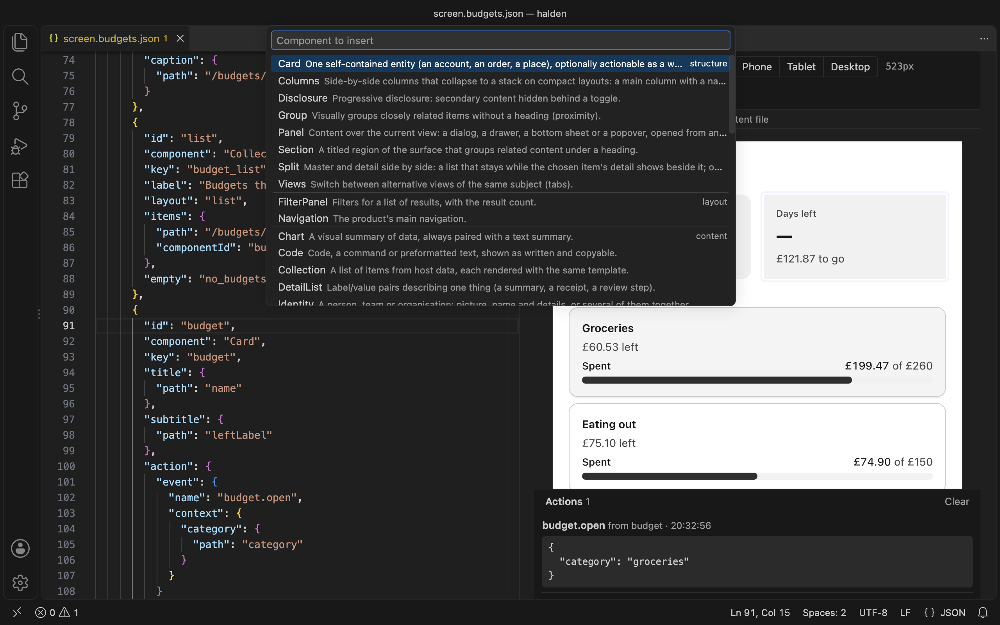
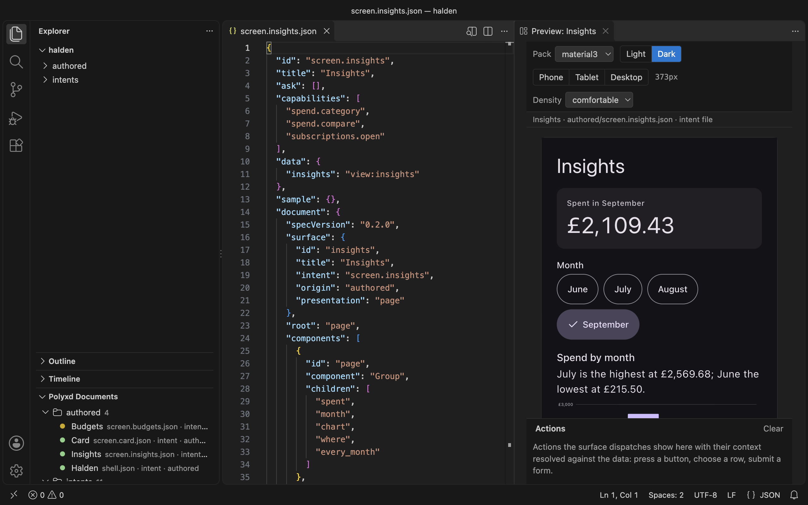

# Polyxd for VS Code

Write [Polyxd](https://polyxd.com) UI documents with the check and the preview beside you. See every mistake as you type. See the screen in any of 13 design systems while you write it.

Works in VS Code, Cursor, VSCodium and Windsurf.



## What it does

- **Completion and hover text.** Files named `*.polyxd.json`, or kept in `authored/`, `intents/` or `screens/` folders, get completion and hover text from the spec's JSON Schema. The schema is bundled, so nothing is fetched. Intent files are checked inside their `document`. Any other file gets the same by naming `"$schema": "https://polyxd.com/schema/0.3/ui.schema.json"`.
- **The static check as you type.** The spec's validator runs on each edit and on save. It checks the document against its own `data`, or a `<name>.data.json` file beside it. A structural problem is an error. A binding that reads nothing is a warning, with a "did you mean". Each one is underlined where it is.
- **A live preview.** Open it from the title bar, or run **Polyxd: Open preview**. It uses the real renderer, in any of the 13 built-in design systems or your own. Switch light and dark, phone, tablet or desktop, or drag the edge to any width. It updates as you type and keeps what you typed into its inputs.
- **Both ways between JSON and screen.** Click a component in the preview and the cursor goes to its JSON. Put the cursor in a component's JSON and the preview outlines it.
- **An action log.** Press a button or submit a form in the preview. The action shows below it, with its context filled in from the data.
- **Commands.** Verify the document in every design system, insert a component, or send the document to Polyxd Studio.
- **Polyxd documents in the Explorer.** Every document in the workspace, by folder, with a dot for its check: green, yellow or red.







## Install

Search for **Polyxd** in the Extensions view, or install it from the command line:

```sh
code --install-extension Polyxd.polyxd-vscode
```

- **VS Code:** [Visual Studio Marketplace](https://marketplace.visualstudio.com/items?itemName=Polyxd.polyxd-vscode)
- **Cursor, VSCodium and Windsurf:** [Open VSX](https://open-vsx.org/extension/polyxd/polyxd-vscode)

To build it from the repository instead:

```sh
git clone https://github.com/visualfart/polyxd && cd polyxd
npm ci
npm run build -w @polyxd/core && npm run build:preview -w @polyxd/react
npm run package -w polyxd-vscode
code --install-extension apps/vscode/polyxd-vscode-0.3.0.vsix     # or: cursor --install-extension …
```

In Cursor, VSCodium and Windsurf you can also use **Extensions → … → Install from VSIX**.

## Start

Open a folder with Polyxd documents in it. A document is a JSON file with `specVersion` and `components`, or an intent file with a `document` inside. The [Halden demo](https://github.com/visualfart/polyxd/tree/main/apps/demos/halden) has both. Then run **Polyxd: Open preview**.

**Verify document** needs the verifier in your project: `npm install -D @polyxd/verifier playwright && npx playwright install chromium`. Without it, the command runs it through `npx`.

## Commands

<!-- generated:commands (node scripts/readme.ts, from package.json) -->
| Command | What it does | Available |
|---|---|---|
| **Polyxd: Open preview** | Opens the live preview beside the editor. Also the icon in a document's title bar. | Always |
| **Polyxd: Verify document** | Runs `polyxd-verify` on the document in a terminal: all 13 packs, light and dark, 390 and 1100 wide. | In a Polyxd document |
| **Polyxd: Insert component** | Picks one of the 44 components by category and inserts a valid skeleton at the cursor. | In a Polyxd document |
| **Polyxd: Open in Studio** | Copies the document to the clipboard and opens Polyxd Studio, where Paste JSON makes a screen of it. | In a Polyxd document |
| **Polyxd: Push to Studio** | Runs `polyxd studio push` for the document, with your Studio API key. | In a Polyxd document |
| **Polyxd: Set Studio API key** | Stores your Studio API key in the editor's secret storage. Leave it empty to remove it. | Always |
| **Polyxd: Refresh** | Rescans the workspace for the Polyxd documents view (its title-bar button). | Documents view only |
<!-- /generated:commands -->

## Settings

<!-- generated:settings (node scripts/readme.ts, from package.json) -->
| Setting | Default | What it does |
|---|---|---|
| `polyxd.pack` | (empty) | A design-system pack of your own for the preview's pack switcher: a `manifest.json` written by `polyxd pack`, compiled here, or an already compiled theme stylesheet. Relative to the workspace folder. |
| `polyxd.defaultPack` | `material3` | The pack the preview opens with. One of `material3`, `carbon`, `antd`, `fluent`, `shadcn`, `bootstrap`, `mantine`, `radix`, `polaris`, `primer`, `spectrum`, `govuk`, `chakra`. |
| `polyxd.studio.workspaceUrl` | (empty) | Your Studio workspace's API base for **Polyxd: Push to Studio**, e.g. `https://studio.polyxd.com/api/w/acme`. The API key is never kept here: set it with **Polyxd: Set Studio API key** (stored in the editor's secret storage) or export `POLYXD_STUDIO_KEY`. |
<!-- /generated:settings -->

The Studio API key is never kept in settings. **Polyxd: Set Studio API key** stores it in the editor's secret storage, or the extension reads `POLYXD_STUDIO_KEY` from the editor's environment.

## Privacy

The extension collects no telemetry and sends nothing on its own. The check and the preview run on your machine, from files inside the extension. It reaches the network only when you ask it to:

- **Open in Studio** opens studio.polyxd.com in your browser.
- **Push to Studio** uploads the document to the Studio workspace you set.
- **Verify document** may download `@polyxd/verifier` from npm, if your project doesn't have it.
- The preview shows images from `https` URLs that your document names.

## Licence

Apache-2.0. See [LICENSE](LICENSE). Source, issues and the spec: [github.com/visualfart/polyxd](https://github.com/visualfart/polyxd). Docs: [polyxd.com/docs/vscode](https://polyxd.com/docs/vscode/).

## Development

```sh
npm run build -w polyxd-vscode        # dist/ and schema/ (esbuild; copies the renderer bundle and the schema)
npm run watch -w polyxd-vscode
npm test -w polyxd-vscode             # the pure pieces, the bundles and this README's tables
npm run test:smoke -w polyxd-vscode   # the built extension against a stand-in vscode module, then in a real VS Code
npm run package -w polyxd-vscode      # polyxd-vscode-<version>.vsix
npm run screenshots -w polyxd-vscode  # images/, from the packaged extension in a real VS Code
npm run readme -w polyxd-vscode       # the Commands and Settings tables above, from package.json
node apps/vscode/scripts/serve-webview.ts   # the preview page in a plain browser, at /
```

The editor smoke test downloads VS Code into `.vscode-test/` the first time (about 300 MB). The extension host bundle (`dist/extension.cjs`) carries `@polyxd/spec`'s validator and the pack compiler. The webview loads `@polyxd/react/preview`'s `polyxd.js` and `polyxd.css`, copied at build time. If `packages/react/preview/` is missing, run `npm run build -w @polyxd/core && npm run build:preview -w @polyxd/react` first. Releasing: see [PUBLISHING.md](PUBLISHING.md).
